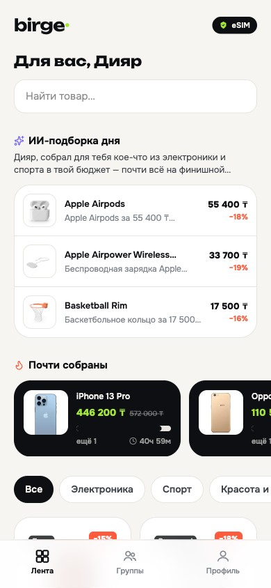
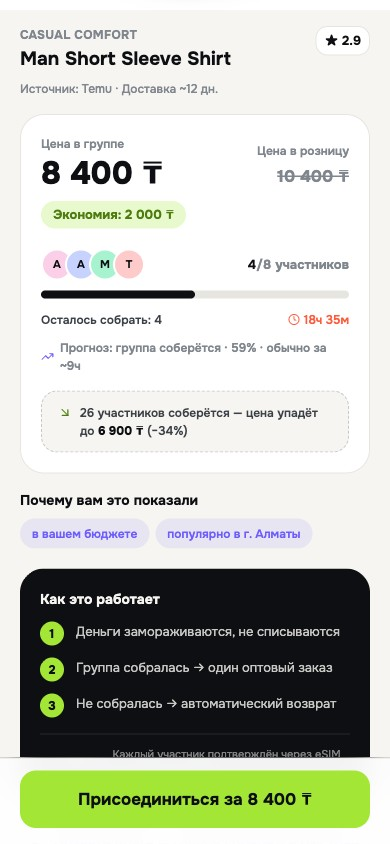
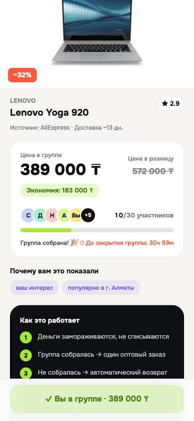

# Birge — покупаем вместе, платим меньше

**Живое демо:** https://hackathon-birge.vercel.app *(откройте на телефоне)*

MVP платформы коллективных покупок с глобальных маркетплейсов для Казахстана —
с персонализированными рекомендациями и концепцией eSIM-идентификации.

<p align="center">
  
  
  
</p>

## Идея

Товар на глобальном маркетплейсе стоит X — до Казахстана он доезжает за 1.5–2X:
розничная наценка, поштучная доставка, серые посредники-«байеры» в Instagram.
Оптовая цена на 30–40% ниже розницы, но опт недоступен одному человеку.

**Birge объединяет покупателей в группы:** товар при индивидуальной покупке стоит
дороже, при коллективной — дешевле. Группа из 10 человек получает первый оптовый
тир, из 25 — второй. Деньги замораживаются (холд) и списываются только когда группа
собралась; не собралась к дедлайну — автоматический возврат. Pinduoduo построил
на этой механике компанию в $100B+ — мы локализуем её для Центральной Азии:
тенге, русский и казахский языки, карго-консолидация по городам.

**Роль SIM/eSIM** — слой безопасной идентификации. Групповые скидки ломаются ботами
и мультиаккаунтами (1 человек = 10 фейковых участников = фейковый опт). eSIM-привязка
делает «1 устройство = 1 реальный участник», а вход работает без SMS-кодов — оператор
подтверждает абонента на сетевом уровне (GSMA Open Gateway, Number Verification API).
Подробный разбор телеком-слоя: [`docs/ESIM.md`](docs/ESIM.md).

## Что работает в MVP

- **Полный пользовательский путь:** регистрация с eSIM-верификацией (концепт по ТЗ) →
  профиль (город/бюджет/возраст) → интересы → персональная лента → карточка →
  присоединение к группе → «Мои группы».
- **Групповая механика с экономикой:** оптовые тиры цен, прогресс и счётчик участников,
  дедлайн с живым таймером, холд/авторефанд, состояние «группа не собралась»,
  лимит вступлений.
- **Realtime между устройствами:** состояние групп живёт в Postgres (Supabase),
  вступления синхронизируются на все открытые устройства мгновенно. Отсканировавший
  QR гость попадает прямо на карточку и вступает без регистрации (гостевой режим).
- **Объяснимые рекомендации:** скоринг по интересам, бюджету, городу и заполненности
  групп — каждая карточка показывает, *почему* она в ленте.
- **Живой ИИ-слой** (Claude Opus, structured outputs, цепочка фолбэков до Gemini):
  - *Подборка дня* — именная подборка с человеческим объяснением пользы;
  - *Семантический поиск* — «подарок девушке до 20 тысяч» находит сумки и косметику
    в бюджете, бюджет извлекается моделью и фильтруется детерминированно;
  - *Прогноз сбора группы* — вероятность и срок.
- **Локализация:** русский + қазақша (переключение в один тап), цены в тенге,
  казахстанские города.
- Каталог (81 товар, имитация Amazon/AliExpress/Temu/Taobao) и все изображения —
  self-hosted: демо не зависит от внешних CDN и переживает плохой Wi-Fi.

## Стек и архитектура

```
React + TypeScript + Vite (mobile-first PWA: manifest + service worker)
        │
        ├── Supabase  — Postgres (состояние групп) + Realtime (postgres_changes)
        ├── Vercel    — хостинг + serverless functions
        │     ├── /api/pick    — LLM-подборка (Claude Opus 4.8 → Gemini 2.5 Flash → локальный фолбэк)
        │     └── /api/search  — поиск: эмбеддинги (Voyage/Gemini, прекомпьют каталога)
        │                         или LLM-ранжирование через Claude
        └── eSIM identity layer (концепт) — прод-путь: GSMA Open Gateway / CAMARA
              (Number Verification, SIM Swap, KYC) — см. docs/ESIM.md
```

Масштабирование поиска посчитано: 81 SKU — косинус в браузере; до ~100k — pgvector
на Supabase; бесплатного лимита эмбеддингов хватает на ~3 млн карточек.

## Запуск локально

```bash
npm install
npm run dev          # http://localhost:5173 — всё работает без ключей (ИИ в фолбэке)

# Полный ИИ-слой (опционально):
# в Vercel/.env: ANTHROPIC_API_KEY (подборка+поиск) и/или GEMINI_API_KEY, VOYAGE_API_KEY
node scripts/embed-catalog.mjs   # прекомпьют векторов каталога (нужен Voyage/Gemini ключ)
```

## Структура

```
src/            приложение (экраны, стор, скоринг, realtime, i18n)
api/            serverless: pick.ts (подборка), search.ts (поиск)
scripts/        генерация каталога, эмбеддинги, тест realtime
docs/ESIM.md    телеком-слой: какие данные даёт оператор и как питают рекомендации
pitch/          питч, сценарий демо, аудит жюри, скриншоты
```

## Дальнейшее развитие

Уровень 1 (этот MVP) — AI-driven платформа коллективных покупок с локализованным
доступом к глобальным маркетплейсам. Уровень 2 — secure commerce ecosystem на
eSIM-идентификации: партнёрство с оператором (анти-фрод, Carrier Billing,
подтверждённые сигналы для персонализации), карго-консолидация по городам,
расширение на УЗ/КР. Роадмап и ответы на вопросы — в [`pitch/PITCH.md`](pitch/PITCH.md).
